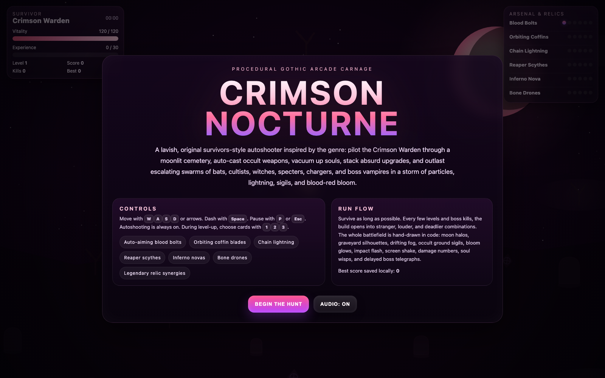
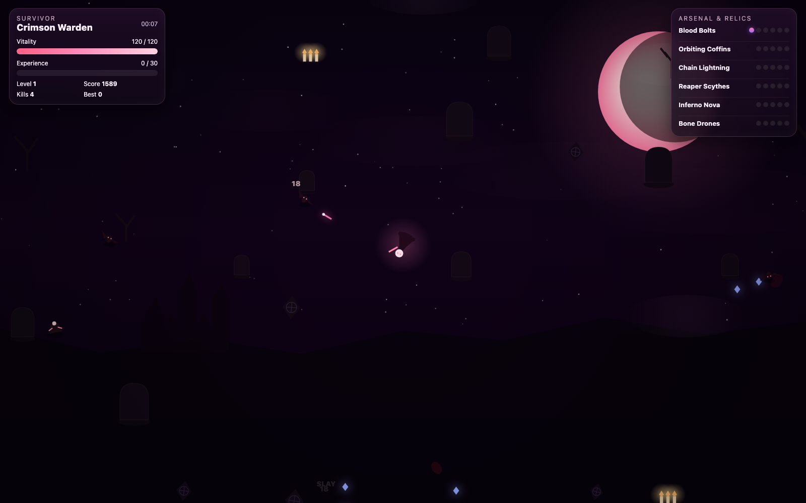
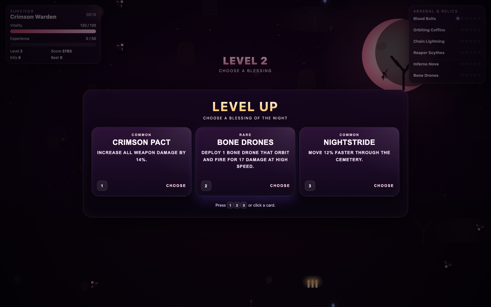

# Crimson Nocturne

Crimson Nocturne is a one-file, survivors-style gothic autoshooter built with plain HTML, CSS, and canvas-powered JavaScript. It drops the Crimson Warden into a moonlit cemetery full of swarms, bosses, relic synergies, particle-heavy combat, and fast arcade movement.

This build started as a one-prompt test against GPT-5.4 Pro and then received one targeted fix with Codex 5.4.

## Original Prompt

```text
Make a vampire survivors autoshooter. Focus on making it as visually exciting, stunning, and complex as possible.
```

## Play Now

[Play Crimson Nocturne](https://raistlinmuc.github.io/crimsonNocturne/index.html?autostart=1)

## Gameplay Preview

[](https://github.com/RaistlinMuc/crimsonNocturne/blob/main/media/video/crimson-nocturne-demo.webm)

Click the preview to open the gameplay video on GitHub.

## Screenshots







## Features

- Full-screen canvas battlefield with a reactive camera and high-DPI rendering fix.
- Survivors-style auto-attacks, pickups, level-ups, bosses, and escalating enemy waves.
- Original code-drawn presentation: moonlight gradients, graveyard silhouettes, fog, bloom, particles, beams, and damage text.
- Keyboard-first arcade controls with dash, pause, and level-up card selection.
- Local high score persistence through `localStorage`.
- Playwright end-to-end coverage for the viewport-filling canvas regression on high-DPI displays.

## Controls

- `W`, `A`, `S`, `D` or arrow keys: move
- `Space`: dash
- `P` or `Esc`: pause
- `1`, `2`, `3`: choose a level-up card

## Run Locally

```bash
python3 -m http.server 4173
```

Open:

```text
http://127.0.0.1:4173/index.html
```

Quick-start directly into gameplay:

```text
http://127.0.0.1:4173/index.html?autostart=1
```

## Development

Install dependencies:

```bash
npm install
```

Run the high-DPI end-to-end test:

```bash
npm run test:e2e
```

Rebuild the screenshots and demo video:

```bash
python3 -m http.server 4173
npm run capture:media
```

## GitHub Pages

The repository includes a Pages deployment workflow for the static build. Once GitHub Pages is enabled for the repository, pushes to `main` can publish the game at:

```text
https://raistlinmuc.github.io/crimsonNocturne/index.html
```
